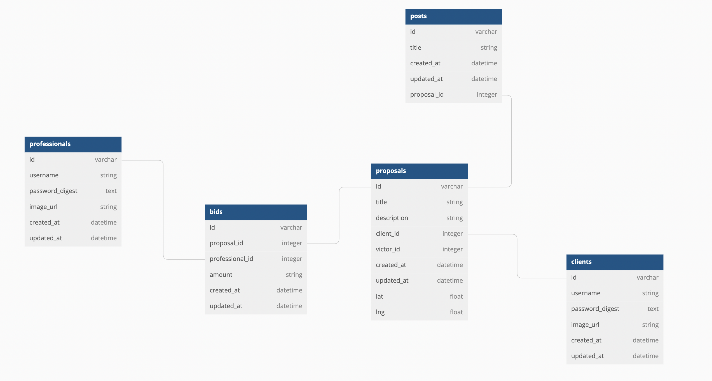

# Ready-Set-Bid: React/Rails API

## Description

Ready-Set-Bid is a bidding wars web application. Let's say you are a homeowner with a huge brush pile in your back yard that you need to have cleaned up. The only problem is, you have no idea how to find someone you can trust to come do the work for a fair price. Enter Ready-Set-Bid. Ready-Set-Bid allows 'Professionals' the oppertunity to bid on your project. As a client you simply create an account, upload a few pictures and watch the bids. Once you see a bid that you feel is at a fair price, you click 'accept bid'. That's it.

Likewise for professionals, you can:

1. Create an account.
2. View all the projects which are available for bidding and their location on a map.
3. Make a bid for any number of projects you like.

Once you have won a bid, that bid is updated to include you as the winner and bidding will be closed.

## A video walkthrough for this site can be found at:

<>

## Requirements

- Ruby 2.7.4
- NodeJS (v16), and npm
- Heroku CLI
- Postgresql

See Environment Setup below for instructions on installing these tools if you
don't already have them.

## Setup

Start by **cloning** the project repository:

```console
$ git clone git@github.com:JPStupfel/ready-set-bid.git
$ cd ready-set-bid
$ code .
```

When you're ready to start working on this project, run:

```sh
bundle install
rails db:create
npm install --prefix client
```

You can use the following commands to run the application:

- `rails s`: run the backend on [http://localhost:3000](http://localhost:3000)
- `npm start --prefix client`: run the frontend on
  [http://localhost:4000](http://localhost:4000)

## Environment Setup

### Install the Latest Ruby Version

Verify which version of Ruby you're running by entering this in the terminal:

```sh
ruby -v
```

Make sure that the Ruby version you're running is listed in the [supported
runtimes][] by Heroku. At the time of writing, supported versions are 2.6.8,
2.7.4, or 3.0.2. Our recommendation is 2.7.4, but make sure to check the site
for the latest supported versions.

If it's not, you can use `rvm` to install a newer version of Ruby:

```sh
rvm install 2.7.4 --default
```

You should also install the latest versions of `bundler` and `rails`:

```sh
gem install bundler
gem install rails
```

[supported runtimes]: https://devcenter.heroku.com/articles/ruby-support#supported-runtimes

### Install NodeJS

Verify you are running a recent version of Node with:

```sh
node -v
```

If your Node version is not 16.x.x, install it and set it as the current and
default version with:

```sh
nvm install 16
nvm use 16
nvm alias default 16
```

You can also update your npm version with:

```sh
npm i -g npm
```

### Install Postgresql

#### PostgreSQL Installation for WSL

To install Postgres for WSL, run the following commands from your Ubuntu terminal:

```sh
sudo apt update
sudo apt install postgresql postgresql-contrib libpq-dev
```

Then confirm that Postgres was installed successfully:

```sh
psql --version
```

Run this command to start the Postgres service:

```sh
sudo service postgresql start
```

Finally, you'll also need to create a database user so that you are able to
connect to the database from Rails. First, check what your operating system
username is:

```sh
whoami
```

If your username is "ian", for example, you'd need to create a Postgres user
with that same name. To do so, run this command to open the Postgres CLI:

```sh
sudo -u postgres -i
```

From the Postgres CLI, run this command (replacing "ian" with your username):

```sh
createuser -sr ian
```

Then enter `control + d` or type `logout` to exit.

[This guide][postgresql wsl] has more info on setting up Postgres on WSL if you
get stuck.

[postgresql wsl]: https://docs.microsoft.com/en-us/windows/wsl/tutorials/wsl-database#install-postgresql

#### Postgresql Installation for OSX

To install Postgres for OSX, you can use Homebrew:

```sh
brew install postgresql
```

Once Postgres has been installed, run this command to start the Postgres
service:

```sh
brew services start postgresql
```

## Troubleshooting

If you ran into any errors along the way, here are some things you can try to
troubleshoot:

- If you're on a Mac and got a server connection error when you tried to run
  `rails db:create`, one option for solving this problem for Mac users is to
  install the Postgres app. To do this, first uninstall `postgresql` by running
  `brew remove postgresql`. Next, download the app from the
  [Postgres downloads page][postgres downloads page] and install it. Launch the
  app and click "Initialize" to create a new server. You should now be able to
  run `rails db:create`.

- If you're using WSL and got the following error running `rails db:create`:

  ```txt
  PG::ConnectionBad: FATAL:  role "yourusername" does not exist
  ```

  The issue is that you did not create a role in Postgres for the default user
  account. Check [this video](https://www.youtube.com/watch?v=bQC5izDzOgE) for
  one possible fix.

  ## Database Structure

The Active Record Model here is linked to an SQL database with five distinct tables.

These tables have a Database structure that looks like this:


The above diagram was created using [dbdiagram.io][]

## Component Hierarchy

Below is a map of the component hierarchy of all React Components used in this project.

```
Index
|---------	App
	|---------NavBar
	|---------SignupContainer
		|---------SignupClientForm
		|---------SignupProForm
	|---------LoginContainer
		|---------LoginClientForm
		|---------LoginProForm
	|---------AddProjectContainer
		|---------AddProjectMap
		|---------fileForm
		|---------AddProjectForm
	|---------ProjectsPage
		|---------MapContainer
			|---------CustomMarker
		|---------ProjectProfessionalCard
	|---------MyProjectsPage
		|---------MapContainer
			|---------CustomMarker
		|---------ProjectClientCard
	|---------ViewMyProjectPage
		|---------MapContainer
			|---------CustomMarker
		|---------ViewProjectImageCard
		|---------MyProjectBidList
			|---------MyProjectBidItem
	|---------MyWonProjectsPage
		|---------MyWonProjectCard
	|---------ViewWonProjectPage


```

# References

To create the database diagrams in this readme I used: https://dbdiagram.io/d (for diagraming tables)

I used Bootstrap available at https://getbootstrap.com/ for stylizing.

react-google-maps

## This application makes use of three external API's, each requiring unique API keys that will have to be replaced within the code as follows:

Note, for numbers 1 & 2 you will need a paid google maps api subscription. To do so, follow the prompts on this page: https://developers.google.com/maps/documentation/javascript/get-api-key

1. Google Maps Javascript API, you must create a .env file in the client directory and include REACT_APP_API_KEY= Your API Key here.

2. Google Maps Geocoding API, you must create a .env file in the root directory and include API_KEY= Your API Key here.

3. You will need to sign up for a Cloudinary account at https://cloudinary.com/. In the Cloudinary home menu, navigate to the "getting started" icon. Then select 'Configure your SDK' > Start configuring. Under "Ruby", copy the code in the lower window. Then create a file cloudinary.yml file in your config directory. Finally, paste the copied code into this file.
